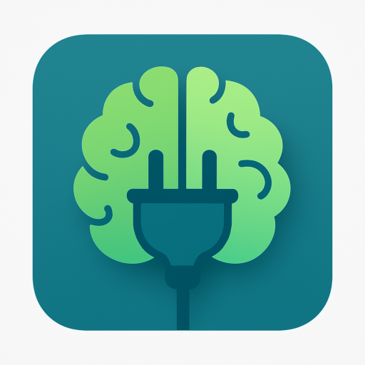

  

# PlugBrain
PlugBrain is an app that encourages regular breaks from distracting apps by blocking access at scheduled intervals.
To regain access, you’ll need to solve a math challenge that adjusts in difficulty: 
the more frequently you use the apps, 
the harder the challenges become — but the longer you stay away, the easier they get.

# Features
  - Blocks distracting apps
  - Unblock apps by solving math challenges
  - Difficulty increases with frequent use, decreases with focus
  - No tracking, no ads
  - No internet required

# How to use
  - Grant all required permissions
  - Select distracting apps
  - Choose your focus frequency
  - Stay focused ;)

[Latest APK](https://github.com/msbelaid/PlugBrain/releases/latest/download/app-release.apk)

License: [GNU GPLv3](https://www.gnu.org/licenses/gpl-3.0.en.html)

