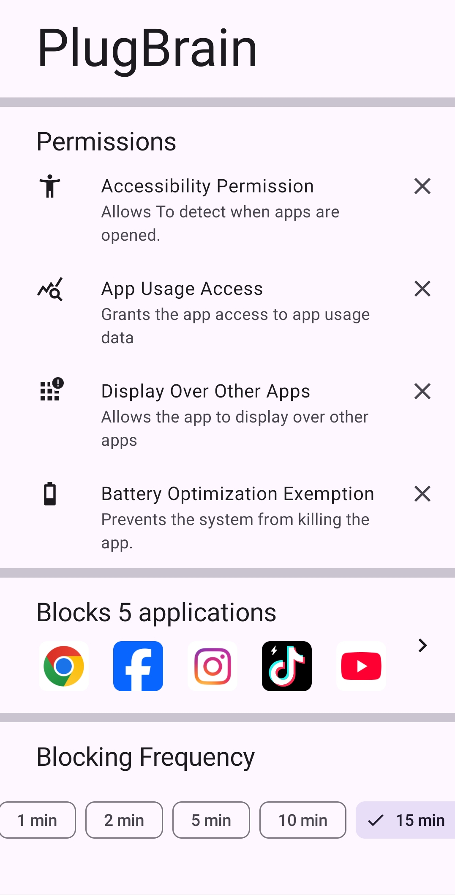
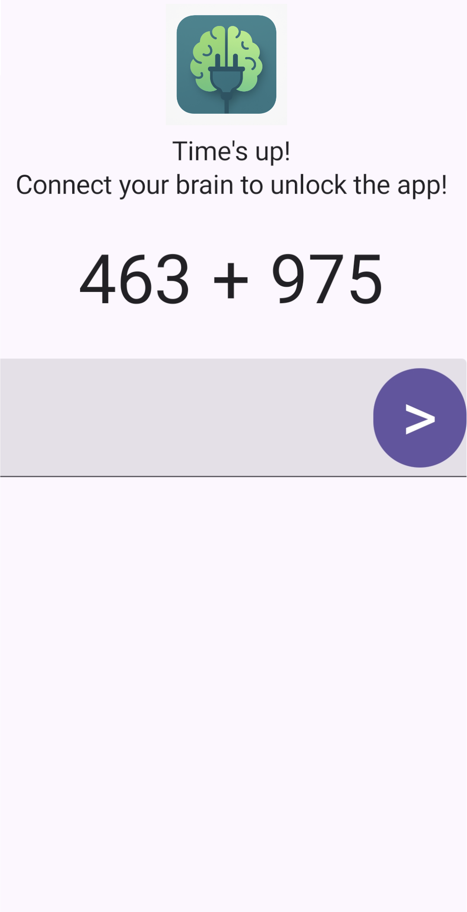
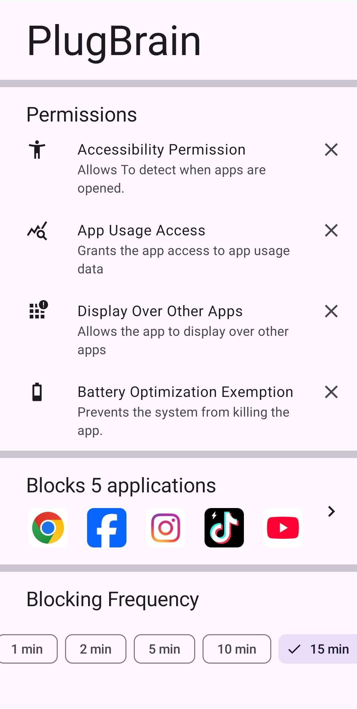

  

# PlugBrain
PlugBrain is an app that encourages regular breaks from distracting apps by blocking access at scheduled intervals.
To regain access, you’ll need to solve a math challenge that adjusts in difficulty: 
the more frequently you use the apps, 
the harder the challenges become, but the longer you stay away, the easier they get.

## Features
  - Blocks distracting apps
  - Unblock apps by solving math challenges
  - Difficulty increases with frequent use, decreases with focus
  - No tracking, no ads
  - No internet required

## How to use
  - Grant all required permissions
  - Select distracting apps
  - Choose your focus frequency
  - Select minimum starting difficulty
  - Stay focused ;)

  
  
  

## Download

## Contributing

Want to contribute? Follow these quick steps:

1. Fork this repository
2. Clone your fork
3. Create a new branch
4. Make your changes
5. Commit your changes
6. Push to the branch
7. Open a pull request
8. Make sure the CI pass

## Tech stack
PlugBrain is built using modern Android libraries and tools:

- 100% [Kotlin](https://kotlinlang.org/)
- [Jetpack Compose](https://developer.android.com/jetpack/compose) as UI toolkit
- [Kotlin Coroutines](https://kotlinlang.org/docs/coroutines-overview.html) & Flow for asynchronous.
- [Koin](https://insert-koin.io/) for Dependency injection
- Architecture 
  - MVVM Architecture (Declarative View - ViewModel - Model)
  - Repository pattern
- [DataStore](https://developer.android.com/topic/libraries/architecture/datastore) – Storage for user preferences
- [Lifecycle](https://developer.android.com/jetpack/androidx/releases/lifecycle) – ViewModel and lifecycle-aware components
- [Material 3](https://m3.material.io/) – Material Design components
- [Coil](https://coil-kt.github.io/coil/) – Image loading for Android
- [UsageStatsManager](https://developer.android.com/reference/android/app/usage/package-summary) for app usage tracking
- [JUnit](https://junit.org/junit5/) – Unit testing
- [MockK](https://mockk.io/) – Mocking library
- [Timber](https://github.com/JakeWharton/timber) – Logging
- [Ktlint](https://pinterest.github.io/ktlint/) – Kotlin code style checking
- [GitHub Actions](https://github.com/features/actions) – CI/CD for builds, tests, and releases

## License
[GNU GPLv3](https://www.gnu.org/licenses/gpl-3.0.en.html)

## Community
We'd love to hear your use cases, success stories, and feedback.
- [Reddit](https://www.reddit.com/r/PlugBrain/)
- [GitHub Discussions](https://github.com/msbelaid/PlugBrain/discussions)
