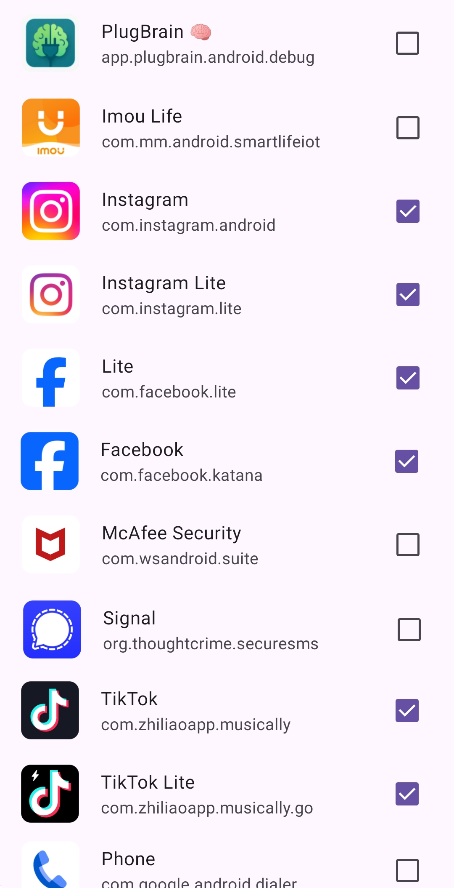

  

# PlugBrain
PlugBrain is an app that encourages regular breaks from distracting apps by blocking access at scheduled intervals.
To regain access, you’ll need to solve a math challenge that adjusts in difficulty: 
the more frequently you use the apps, 
the harder the challenges become — but the longer you stay away, the easier they get.

  
  
  

---

# Features
  - Blocks distracting apps
  - Unblock apps by solving math challenges
  - Difficulty increases with frequent use, decreases with focus
  - No tracking, no ads
  - No internet required

---

# How to use
  - Grant all required permissions
  - Select distracting apps
  - Choose your focus frequency
  - Stay focused ;)

# Download

# Contributing

Want to contribute? Follow these quick steps:

1. Fork this repository
2. Clone your fork
3. Create a new branch (`git checkout -b feature/YourFeature`)
4. Make your changes
5. Commit your changes (`git commit -m 'Add some feature'`)
6. Push to the branch (`git push origin feature/YourFeature`)
7. Open a pull request
8. Make sure the CI pass

# License
[GNU GPLv3](https://www.gnu.org/licenses/gpl-3.0.en.html)

